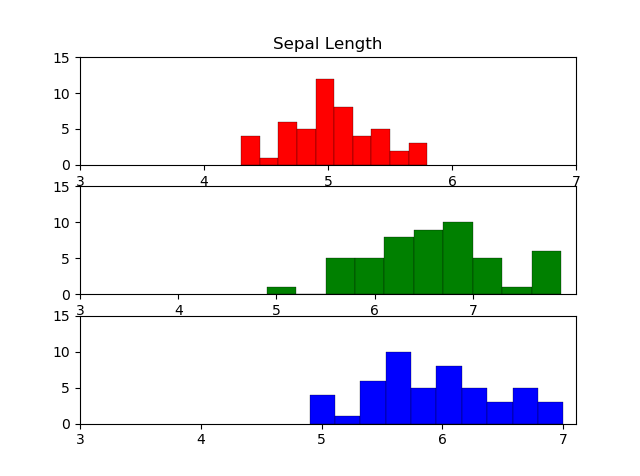
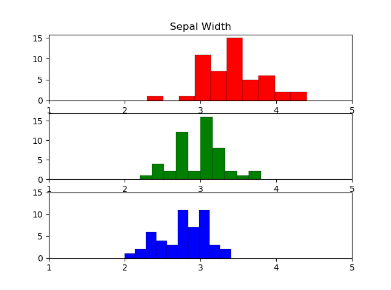
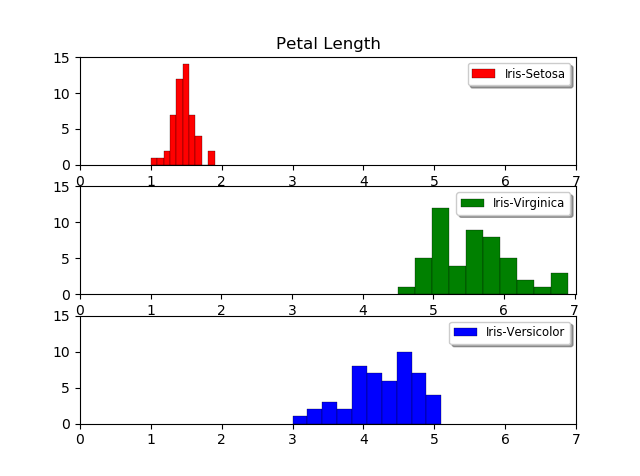

# Python-Project-2018

## Background Information on the Iris Dataset
**The Iris Dataset** is a multivariate data set. 
There are three species included in the Iris set; Iris Setosa, Iris Versicolour and Iris Virginica. 
Each species has a total of 50 samples measured, leading to 150 samples in total. 
In each sample, four measurements were taken; sepal length, sepal width, petal length and petal width. There are no missing data points and all the data is measured in centimetres. 

## Project Plan
My aim in analyzing the Iris Dataset is to determine if there is any relationship between the four different measurements and the three different species. I am looking for nice patterns that may indicate a relationship between variables, or distinguish between species. 

I intend to:
  * Calculate various measures of central tendency and spread for the four measurements in my dataset.
  * Compare pairs of measurements on scatter diagrams to determine if there is any relationship between them, and calculate the correlation coefficient. 
  * Compare pairs of measurements on scatter diagrams, differentiated by species. 

As this is my first statistical analysis project, I did not have any concrete goals in mind, beyond determining correlation. As I worked my way through this project, I understood the limitations of my initial plan and expanded upon it. 

* I realised I needed a graphical representation of distribution for the four measurements. 
  * I placed data for each measurement into a histogram to get a graph of the distribution, along the same intervals of the x and y axes.
* From my intial investigation, it was clear that petal length and petal width correlate strongly. I began to consider if it would be possible to get an equation that modelled the relationship between variables. So,
  * I determined the equation of the line of best fit,  and calculated r squared and p values to get a bettter indication of correlation.

## Python Scripts
* **Calculations.py -** Calculates the max value, min value, range, interquartile range, mean, median, mode, standard deviation and variance for each of the four measurements in the Iris Dataset. This program will list calculations in your application. 
* **Hist.py -** This program will display the distribution of the four measurements in the Iris Dataset. There are 8 graphs in total. Graphs 5 - 8 display this data along the same intervals of the x and y axes. 
* **Hist2.py -** This program will display the four measurments on 3 different subplots in order to compare the distribution of species. There are 4 graphs in total.
* **Scatter1.py -** This program displays 6 scatter graphs combining the measurements from the Iris Dataset.On each graph the line of best fit is also plotted. This program will output the slope, y-intercept and equation of the lines of best fit. It also prints calculations related to correlation: the correlation co-efficient, r squared value, and p value.   When running this program, the relevant calculations will appear in your application when the image of the corresponding scatter diagram opens. Please close that window to move onto the next scatter diagram and it's calculations.
* **Scatter2.py -** This program displays the same 6 scatter diagrams as scatter1.py, but these are colored to distinguish between species. 

## My Analysis of the Iris Dataset

<h3>Central Tendency and Distribution</h3>
<table>
 <tr>
  <th>Sepal Length</th>
  <th>Sepal Width</th>
  <th>Petal Length</th>
  <th>Petal Width</th></tr>
 <tr>
   <td></td>
   <td></td>
   <td></td>
   <td></td></tr>
 <tr>
  <td> Minimum Value:  4.3  
  Maximum Value:  7.9  
  Range:  3.6 
  Interquartile Range:  1.3  
  Mean: 5.8433 
  Median:  5.8  
  Mode:  5.0   
  Standard Deviation:  0.8253    
  Variance:  0.6811</td>
  <td> Minimum Value:  2.0 
  Maximum Value:  4.4 
  Range:  2.4 
  Interquartile Range:  0.5 
  Mean: 3.0540  
  Median: 3.0  
  Mode:  3.0 
  Standard Deviation:  0.4321    
  Variance:  0.1868 </td> 
<td>
  Minimum Value:  1.0 
  Maximum Value:  6.9 
  Range:  5.9 
  Interquartile Range:  3.5 
  Mean: 3.7587 
  Median: 4.35 
  Mode:  1.5 
  Standard Deviation:  1.7585 
  Variance:  3.0924 </td>
<td>
  Minimum Value:  0.1 
  Maximum Value:  2.5 
  Range:  2.4 
  Interquartile Range:  1.5 
  Mean: 1.1987 
  Median: 1.3 
  Mode:  0.2 
  Standard Deviation:  0.7606 
  Variance:  0.5785 </td>
</tr>
  <td></td>
  <td></td>
  <td></td>
  <td></td></tr>
 </table>

* Petal Length is the most spread out measurement with the highest range, IQR and standard deviation. The length varies from 1cm to 6.9cm in this set of data. The wide range of values and presence of outliers, resulted in 3 very different mmeasures of central tendency. (Mean 3.8, Median 4.4 and Mode 1.5)

* Sepal Width and Petal Width both share the smallest range value of 2.4. Sepal Width is more effected by outliers, with an IQR of 0.5. Meanwhile the IQR of Petal Width is 1.5, reflecting the greater range of values in that set. 

* The variation across the four measurements is quite likely to be due to the variation across species. Using subplots to plot these measurements according to species appears to verify this. 

<table>
  <tr>
  <th>Sepal Length</th>
  <th>Sepal Width</th>
  <th>Petal Length</th>
  <th>Petal Width</th></tr>
 <tr>
<tr>
  <td></td>
  <td></td>
  <td></td>
  <td></td></tr>
</table>

* Petal Length and Petal Width measurements appear to provide the most clear differences between species. Setosa has length less than 2 cm and width less than 1cm.  Virginica has length between 4.5 and 7cm and width between 1.5 and 2.5cm approximately. Versicolor has length between 3 and 5cm and width between 1 and 2cm. While there is some overlap bettwen Virginica and Versicolor, these measurements could form the basis for identifying species from measurements.

<h3>Correlation</h3>
<table><tr>
  <th colspan=3>Sepal Length vs. Sepal Width</th></tr>
 <tr>
   <td></td>
   <td></td>
  <td width = 30%><b>Slope of the best fit line:</b> -0.0573 
    <b>Y-intercept:</b> 3.38863737949 
    <b>Equation:</b> y = 3.39  -  0.06x  
    <b>R Value:</b> -0.1094 
    <b>R&sup2 Value:</b> 0.012 
    <b>P Value:</b> 0.1827652153</td></tr>
 <tr>
  <th colspan=3>Petal Length vs.Petal Width</th></tr>
 <tr>
   <td></td>
   <td></td>
  <td width = 30%><b>Slope of the best fit line:</b> 0.4164 
   <b>Y-intercept:</b> -0.36651404521 
   <b>Equation:</b> y = -0.37  +  0.42x  
   <b>R Value: </b>0.9628 
   <b>R&sup2 Value: </b>0.9269 
   <b>P Value:</b> 0.0, to 10dp</b></td></tr>
 <tr>
  <th colspan=3>Sepal Width vs. Petal Width</th></tr>
  <tr>
   <td></td>
   <td></td>
  <td width = 30%><b>Slope of the best fit line:</b> -0.6275 
   <b>Y-intercept:</b> 3.115192687 
   <b>Equation:</b>y = 3.12  -  0.63x  
   <b>R Value:</b> -0.3565 
   <b>R&sup2 Value:</b> 0.1271 
   <b>P Value:</b> 0.0000075239</td></tr>
 <tr>
  <th colspan=3>Sepal Length vs. Petal Length </th></tr>
  <tr>
   <td></td>
   <td></td>
  <td width = 30%><b>Slope of the best fit line:</b> 1.8575 
   <b>Y-intercept:</b> -7.0953814783 
   <b>Equation:</b> y = -7.10  +  1.86x 
   <b>R Value:</b> 0.8718 
   <b>R&sup2 Value:</b> 0.76 
   <b>P Value:</b> 0.0, to 10dp</td></tr>
   <tr>
  <th colspan=3>Sepal Length vs. Petal Width </th></tr>
  <tr>
   <td></td>
   <td></td>
    <td width = 30%><b>Slope of the best fit line:</b> 0.7538 
          <b>Y-intercept:</b> -3.2062768960 
     <b>Equation:</b> y = -3.21  +  0.75x 
     <b>R Value: </b>0.818 
     <b>R&sup2 Value: </b>0.669 
     <b>P Value:</b> 0.0, to 10dp</td></tr>
   <tr>
  <th colspan=3>Sepal Width vs. Petal Length </th></tr>
   <tr>
   <td></td>
   <td></td>
    <td width = 30%><b>Slope of the best fit line:</b> -1.7112 
     <b>Y-intercept:</b> 8.98467570546 
     <b>Equation:</b> y = 8.98  -  1.71x 
     <b>R Value:</b> -0.4205 
     <b>R&sup2 Value:</b> 0.1768 
     <b>P Value:</b> 0.0000000843</td></tr>
 </table>
 
* The most statistiallly significant correlation is between Petal Length and Petal width measurements. These measurements provide the highest correlation coefficient (0.9628) and the highest r-squared value (0.9269). The p-value, also indicates that the probability of no relationship between these variables is (5.78 x 10^-86), which I rounded to zero above. 

* P-values indicate that all scatter diagrams except Sepal Length and Sepal Width, have a statistically significant realtionship (p < 0.05).

* Despite having good p-values, some of these sets have low r-squared values. These are the Sepal Width vs. Petal Length and Sepal Width vs. Petal Width relationships. This suggests that even though there is a statistically significant relationship, the equations of the line of best fit would not be a good model in these cases.

* While data scientists often employ different methods of linear regression than I did here, they often arrive at very similar equations to model the relationship between measurements. Comparing my work to theirs allowed me to identify a very simple mathematical error in my own calculations. 

## Further plans 

This approach helped me to appreciate the importance of using programming languages like Python to conduct data analysis. My own analysis identified errors in P.S. Hoey's mathematical analysis of this set, including an incorrectly identified minimum value. 

Following the completion of my own analysis, I consulted analysis of the dataset conducted by data scientists. 
* Many data scientists use methods of linear regression different to the one I used. I hope to gain a better understanding of linear regression that might be more effective than the line of best fit equation. 
* Many data scientists used methods I'm unfamiliar with to classify a iris using it's measurements and the pre-existing Iris data in this set. I would like to understand clustering methods and the applications used to create predictive models, and apply those to this set. 

## References
* Fisher, R.A. [The use of multiple measurements in taxonomic problems.](https://onlinelibrary.wiley.com/doi/epdf/10.1111/j.1469-1809.1936.tb02137.x)Annals of Eugenics. 7 (2): 179–188. (1936) Accessed on 10/04/2018.
* Cock, Peter. [Linear Regressions and Linear Models using the Iris Data](https://warwick.ac.uk/fac/sci/moac/people/students/peter_cock/r/iris_lm/) Accessed 28/04/2018.
* Ghosh, Sourav. [Clustering Practise with the Iris Dataset](https://www.kaggle.com/meetsourav/clustering-with-iris-dataset) Accessed 28/04/2018.
* Hoey, Patrick S. [Statistical Analysis of the Iris Flower Dataset](http://patrickhoey.com/downloads/Computer_Science/03_Patrick_Hoey_Data_Visualization_Dataset_paper.pdf). University of Massachusetts At Lowell. Accessed on 10/04/2018.
* Santos, Rafael. [Data Science Example: Iris Data Set](http://www.lac.inpe.br/~rafael.santos/Docs/R/CAP394/WholeStory-Iris.html) Accessed 28/04/2017. 
* [The Iris flower data set](https://en.wikipedia.org/wiki/Iris_flower_data_set), Wikipedia. Accessed on 10/04/2018.
* [Simple Linear Regression Demo](https://rstudio-pubs-static.s3.amazonaws.com/304864_413b4745f10d46fab1adfff38333dd1c.html) Accessed 28/04/2018.
