# Python-Project-2018

## Background Information on the Iris Dataset
**The Iris Dataset** is a multivariate data set. 
There are three species included in the Iris set; Iris Setosa, Iris Versicolour and Iris Virginica. 
Each species has a total of 50 samples measured, leading to 150 samples in total. 
In each sample, four measurements were taken; sepal length, sepal width, petal length and petal width. There are no missing data points and all the data is measured in centimetres. 

## Project Plan
My aim in analyzing the Iris Dataset is to determine if there is any relationship between the four different measurements and the three different species. I am looking for nice patterns that may indicate a relationship between variables, or distinguish between species. 

I intend to:
  * Calculate various measures of central tendency and spread for the four measurements in my dataset.
  * Compare pairs of measurements on scatter diagrams to determine if there is any relationship between them, and calculating the correlation coefficient. 
  * Compare pairs of measurements on scatter diagrams, differentiated by species. 

As this is my first statistical analysis project, I did not have any concrete goals in mind, beyond determining correlation. As I worked my way through this project, I understood the limitations of my initial plan and expanded upon it. 

* After running my program Calculations.py, I realised I needed a graphical representation of distribution for the four measurements. 
  * I placed data for each measurement into a histogram to get a graph of the distribution. 
  * I then viewed these distributions along the same intervals of the x and y axes.
* After running my program Scatter.py, it was clear that petal length and petal width correlate strongly. I began to consider if it would be possible to get an equation for length with respect to width. So,
  * I calculated r&sup2 and p values to get a bettter indication of correlation. 
  * I got the slope of the line of best fit, and considered using the slope y-intercept to find its equation. 

## How to Run my Code
Clone or download this repository to the desired directory of your machine. You can now open each program in Visual Studio Code or run from command prompt, if and only if, Python is in your PATH. 

If using Visual Studio Code:
Open folder. Open file. Open Integrated Terminal using CTRL '. Integrated terminal may not be open in the relevant directory. In VS Explorer, rightclick on a file in the required folder, and open in command prompt. Not you can run a program called NAME.py, by typing python NAME.py in the integrated terminal and press Enter. 

If you're using Command Prompt:
Navigate to the relevant folder using cd command, and run dir to get a list of files in the folder. Any python files in this folder can now be run, by typing python NAME.py and pressing Enter. 

<i>Note: Any calculations will be outputted in your application. Graphical representation of the data will open in individual windows, which you must close to move onto the next graph. Please ensure you close the final window to complete the program. </i>

* **Calculations.py -** Calculates the max value, min value, range, interquartile range, mean, median, mode, standard deviation and variance for each of the four measurements in the Iris Dataset. This program will list calculations in your application. 
* **Hist.py -** This program will display the distribution of the four measurements in the Iris Dataset. There are 8 graphs in total. Graphs 5 - 8 display this data along the same intervals of the x and y axes. 
* **Scatter1.py -** This program displays 6 scatter graphs combining the measurements from the Iris Dataset.On each graph the line of best fit is also plotted. It also prints calculations related to correlation: the slope of the line of best fit, the correlation co-efficient, r&sup2 value, and p value. When running this program, the relevant calculations will appear in your application when the image of the corresponding scatter diagram opens. Please close that window to move onto the next scatter diagram and it's calculations.
* **Scatter2.py -** This program displays the same 6 scatter diagrams as scatter1.py, but these are colored to distinguish between species. 

## My Analysis of the Iris Dataset

<h3>Central Tendency and Distribution</h3>
<table>
 <tr>
  <th>Sepal Length</th>
  <th>Sepal Width</th>
  <th>Petal Length</th>
  <th>Petal Width</th></tr>
 <tr>
   <td>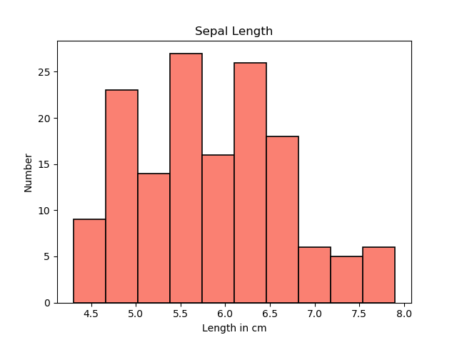</td>
   <td>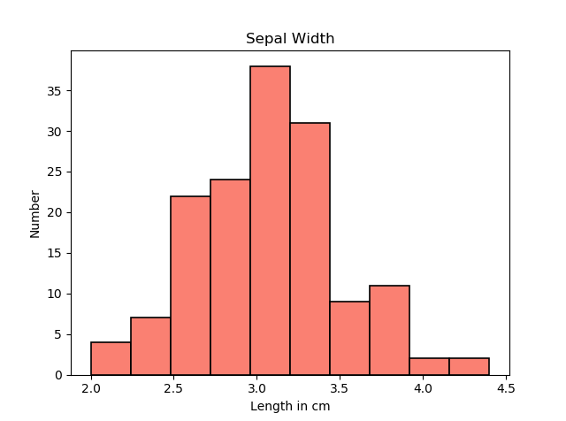</td>
   <td>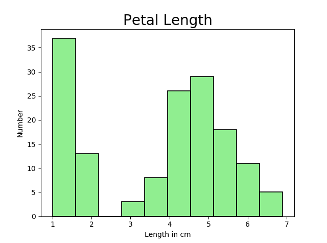</td>
   <td></td></tr>
 <tr>
  <td> Minimum Value:  4.3  
  Maximum Value:  7.9  
  Range:  3.6 
  Interquartile Range:  1.3  
  Mean: 5.8433 
  Median:  5.8  
  Mode:  5.0   
  Standard Deviation:  0.8253    
  Variance:  0.6811</td>
  <td> Minimum Value:  2.0 
  Maximum Value:  4.4 
  Range:  2.4 
  Interquartile Range:  0.5 
  Mean: 3.0540  
  Median: 3.0  
  Mode:  3.0 
  Standard Deviation:  0.4321    
  Variance:  0.1868 </td> 
<td>
  Minimum Value:  1.0 
  Maximum Value:  6.9 
  Range:  5.9 
  Interquartile Range:  3.5 
  Mean: 3.7587 
  Median: 4.35 
  Mode:  1.5 
  Standard Deviation:  1.7585 
  Variance:  3.0924 </td>
<td>
  Minimum Value:  0.1 
  Maximum Value:  2.5 
  Range:  2.4 
  Interquartile Range:  1.5 
  Mean: 1.1987 
  Median: 1.3 
  Mode:  0.2 
  Standard Deviation:  0.7606 
  Variance:  0.5785 </td>
</tr>
  <td>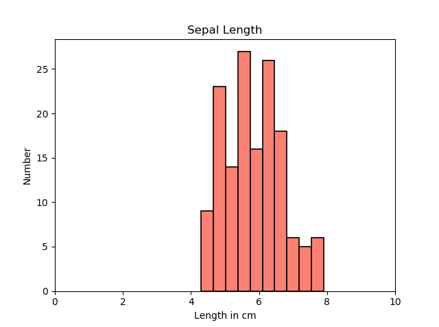</td>
  <td>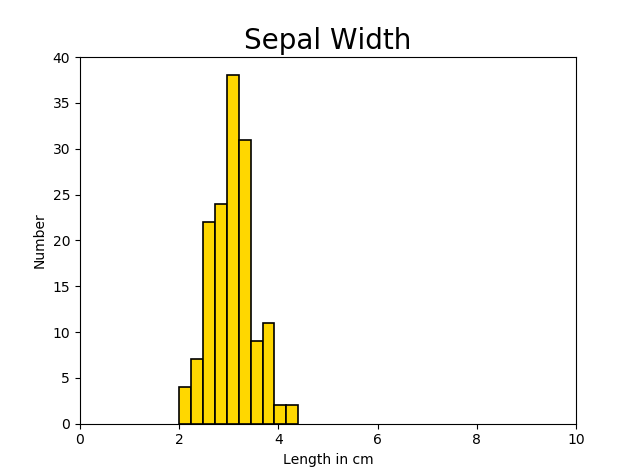</td>
  <td>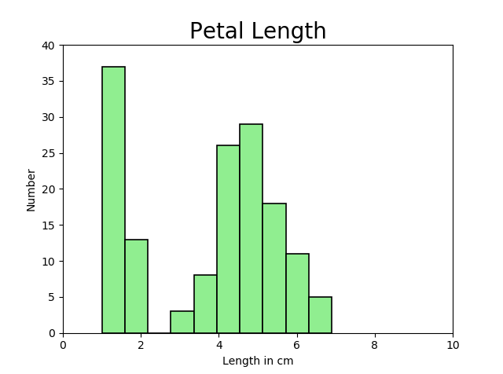</td>
  <td>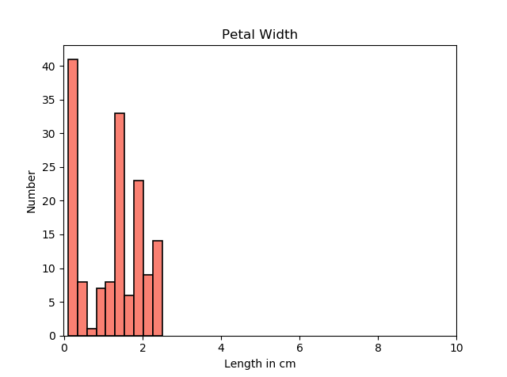</td></tr>
 </table>
 
<h3>Correlation</h3>
<table><col width=100%>
 <tr>
  <th>Sepal Length vs. Sepal Width</th>
   <td>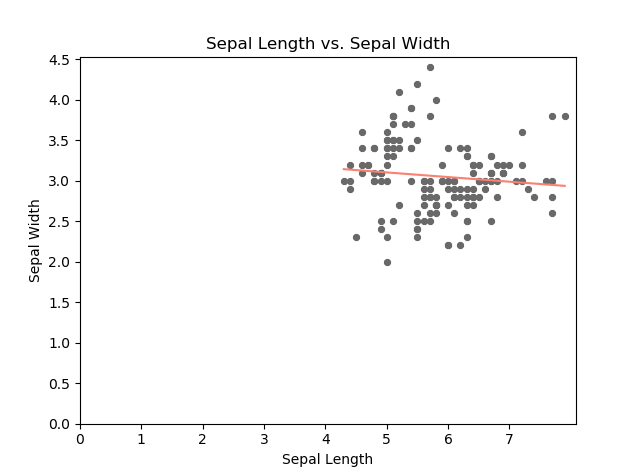</td>
   <td></td>
  <td><b>Slope of the line of best fit:</b> -0.0573 
    <b>R Value:</b> -0.1094 
       <b>R&sup2 Value:</b> 0.012 
       <b>P Value:</b> 0.1827652153</td></tr>
 <tr>
  <th>Petal Length vs.Petal Width</th>
   <td>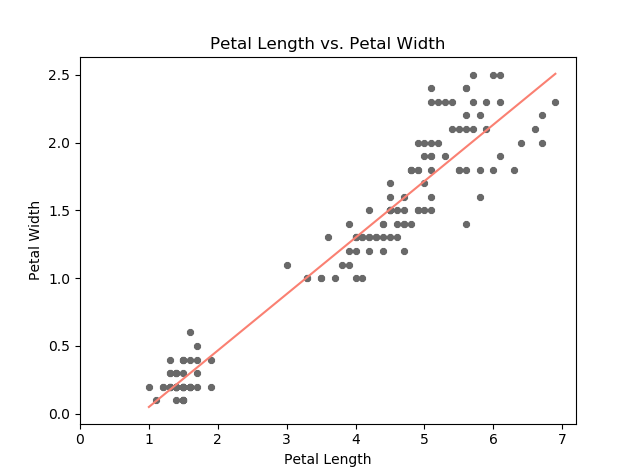</td>
   <td>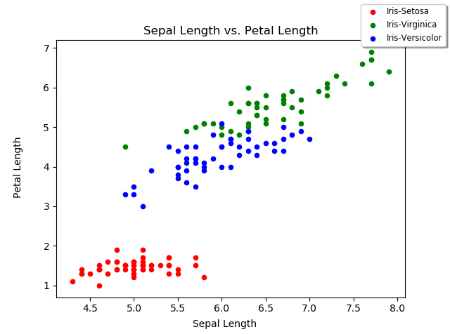</td>
  <td><b>Slope of the line of best fit:</b> 0.4164 
   <b>R Value: </b>0.9628 
   <b>R&sup2 Value: </b>0.9269 
   <b>P Value:</b> 0.0, to 10dp</b></td></tr>
 <tr>
  <th>Sepal Width vs. Petal Width</th>
   <td>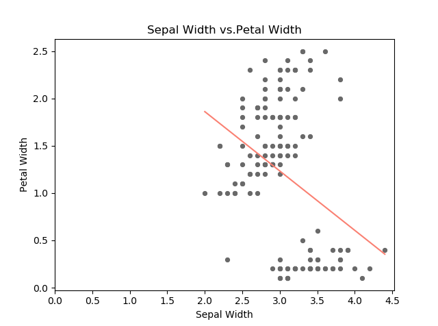</td>
   <td>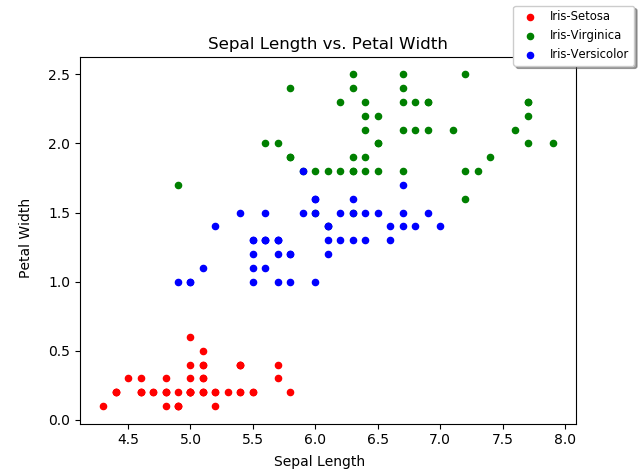</td>
  <td><b>Slope of the line of best fit: </b>-0.6275 
      <b>R Value:</b> -0.3565 
       <b>R&sup2 Value:</b> 0.1271 
       <b>P Value:</b> 0.0000075239</td></tr>
 <tr>
  <th>Sepal Length vs. Petal Length </th>
   <td>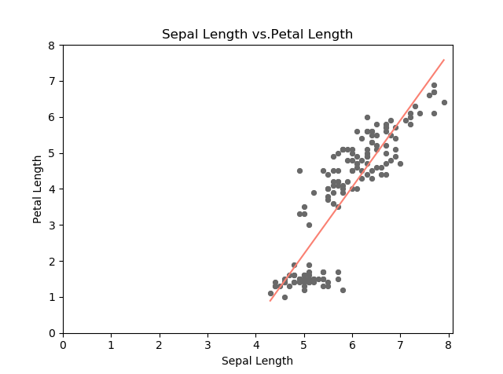</td>
   <td>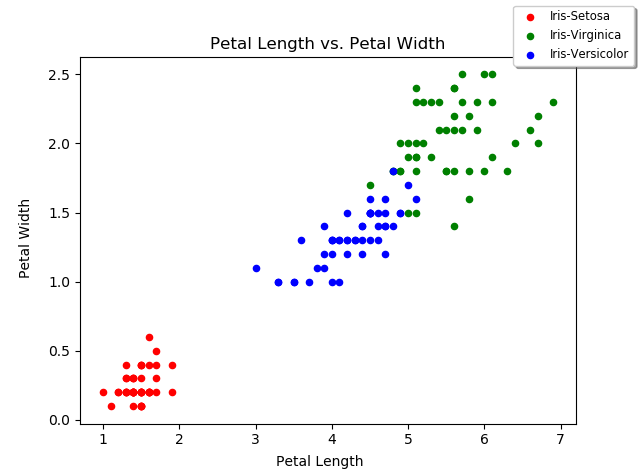</td>
  <td><b>Slope of the line of best fit:</b> 1.8575 
    <b>R Value:</b> 0.8718 
    <b>R&sup2 Value:</b> 0.76 
    <b>P Value:</b> 0.0, to 10dp</td></tr>
   <tr>
  <th>Sepal Length vs. Petal Width </th>
   <td>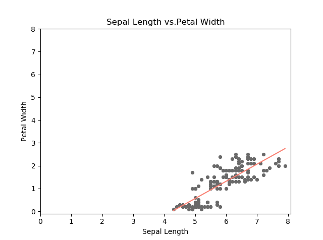</td>
   <td></td>
    <td><b>Slope of the line of best fit:</b> 0.7538 
     <b>R Value: </b>0.818 
     <b>R&sup2 Value: </b>0.669 
     <b>P Value:</b> 0.0, to 10dp</td></tr>
   <tr>
  <th>Sepal Width vs. Petal Length </th>
   <td>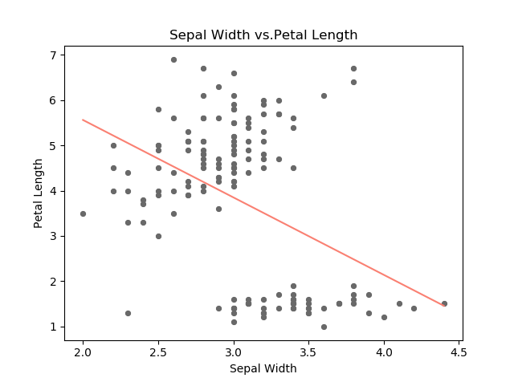</td>
   <td>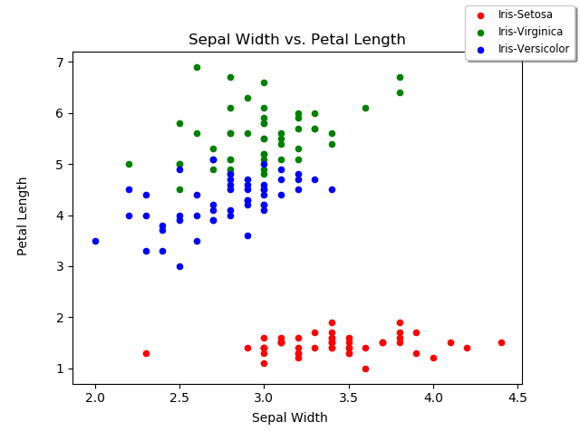</td>
    <td><b>Slope of the line of best fit:</b> -1.7112 
     <b>R Value:</b> -0.4205 
     <b>R&sup2 Value:</b> 0.1768 
     <b>P Value:</b> 0.0000000843</td></tr>
 </table>
 <h3> Summary</h3>

## References
* Fisher, R.A. [The use of multiple measurements in taxonomic problems.](https://onlinelibrary.wiley.com/doi/epdf/10.1111/j.1469-1809.1936.tb02137.x)Annals of Eugenics. 7 (2): 179–188. (1936) Accessed on 10/04/2018.
* Hoey, Patrick S. [Statistical Analysis of the Iris Flower Dataset](http://patrickhoey.com/downloads/Computer_Science/03_Patrick_Hoey_Data_Visualization_Dataset_paper.pdf). University of Massachusetts At Lowell. Accessed on 10/04/2018.
* [The Iris flower data set](https://en.wikipedia.org/wiki/Iris_flower_data_set), Wikipedia. Accessed on 10/04/2018.
